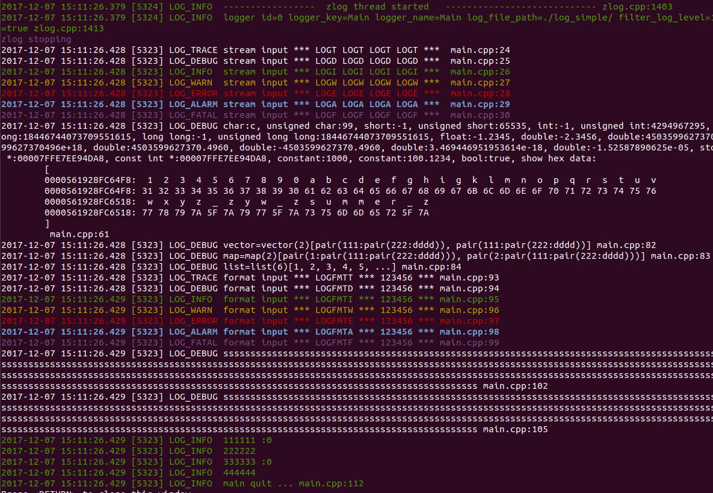

# zlog #

这个`zlog`与其它同名的library并无任何关联，只是碰巧名字雷同。

此项目来源自对于[log4z](https://github.com/zsummer/log4z)的修改，感谢原作者。

修改后新的项目名称为`zlog`，适用于Windows, Ubuntu, 可配合Qt5来使用。

### 1.预览 ###

Console 输出预览：



输出文件内容预览：


### 2.简单使用 ###

```
#include "zlog.h"
using namespace zlog;
LoggerId id = ZLOG_MAIN_LOGGER_ID;
IZLogManager::getRef().start();
LOGD("stream input *** " << "LOGD LOGD LOGD LOGD" << " *** ");
LOGD("float:" << (float)-1.234567<< ", int *:" << (int *)argv);
LOGFMTD("format input *** %s *** %d ***", "LOGFMTD", 123456);
std::string str; // str="some text...";
LOGFMT_DEBUG(id, "%s", str.c_str());
LOG_STREAM(id, LOG_LEVEL_DEBUG, NULL, 0, "debug-text");
```

### 3.在代码中配置 ###

```
LoggerId logid_bar = IZLogManager::getRef().createLogger("bar");
IZLogManager::getRef().setIsDisplayOnConsole(logid_bar, true);
IZLogManager::getRef().setIsWriteToFile(logid_bar, true);
```

### 4.从文件读取配置 ###

**示例 1： MainLogger**

```
IZLogManager::getRef().configFromFile("config.cfg");
```


**示例 2： FooLogger**

```
LoggerId logid_foo = IZLogManager::getRef().findLoggerByKey("foo");
LOG_DEBUG(logid_foo, "foo LOG_DEBUG");
```


### 5.配置文件的写法 ###

```
#[section] (this is logger key)
#log_file_path = ?? (default is ./log/)
#filter_log_level = ?? (ALL, DEBUG, INFO, WARN, ERROR, ALARM, FATAL)
#display_on_console = ?? (default is true, display to screen)
#use_month_dir = ?? (default is false, no month sub-directory)
#log_file_size_limit = ?? (unit:MB, default is 100)
#use_file_line = ?? (default is true)
#logger_enabled = ?? (default is true, stop or start one logger)
#write_to_file = ?? (default is true, output to file)
#log_file_reserve_time = ?? (unit:sec, time to reserve in the list)
```
